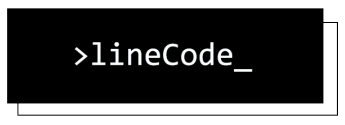

# Documentazione - PORTACS


# Documentazione - PORTACS
Documentazione prodotta in parallelo all'applicativo PORTACS sviluppato come attività progettuale per il corso di Ingegneria del Software dell'Università degli Studi di Padova sotto il nominativo di Progetto _PORTACS_.

## Overview
La documentazione si propone di guidare e normare lo sviluppo del software, e viene consegnata al proponente e al committente insieme al codice prodotto.
Essa viene suddivisa tra documenti ad uso interno del team di sviluppo e documenti esterni, rivolti a proponente e committente.
É composta dai seguenti documenti singoli:
- Analisi dei requisiti;
- Norme di Progetto;
- Piano di Progetto;
- Piano di qualifica;
- Glossario;
- Manuale utente;
- Manuale del manutentore;
- Test design;
- Allegato tecnico;
- Verbali
- Lettere di presentazione per le singole Revisioni;


## Installazione, dipendenze ed esecuzione
Dipendenze:
 - LaTeX 
 
 Clonare repo con:
 ```shell
 git clone https://github.com/lineCode-swe/docs.git
 ```
 Spostarsi nella cartella del documento che si desidera compilare, e eseguire la compilazione del file main.tex.
 Un esempio di compilazione da terminale in un sistema UNIX-like su cui é installata una distribuzione LaTeX quale (MiKTeX)[https://miktex.org/] 
 prevede che, nella cartella sopra citata, venga lanciato il comando:
 ```shell
 pdflatex main.tex
 ```
 che andrá a produrre il file in formato PDF corrispondente
