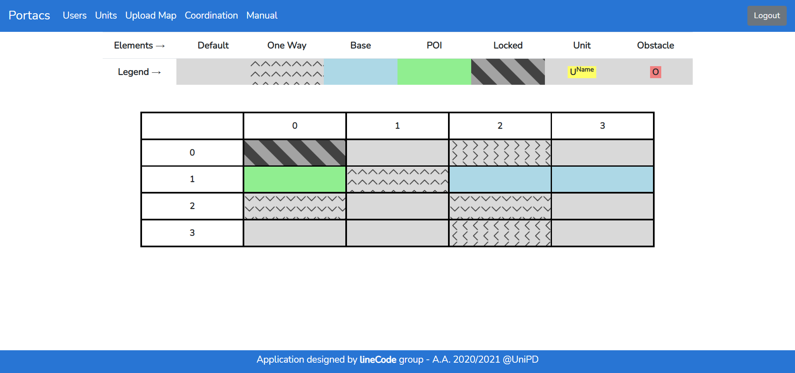
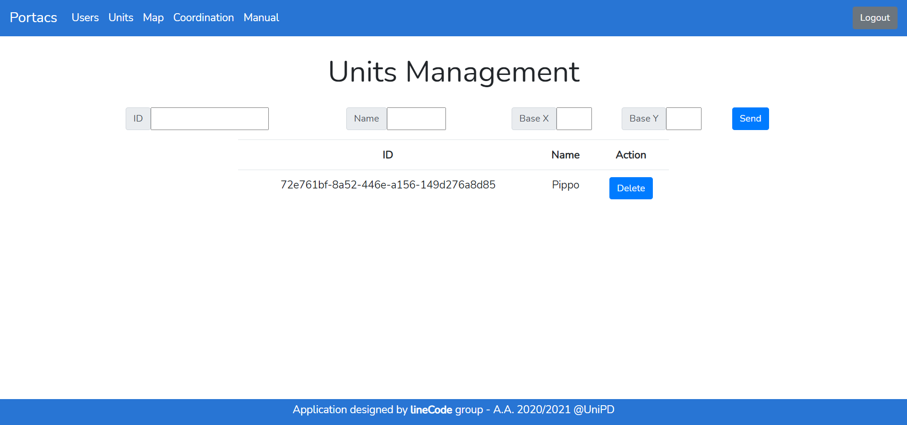

= PORTACS - Manuale Utente
gruppo lineCode <linecode.swe@gmail.com>
v0.1.0, 18-07-2021
:doctype: book
:title-logo-image: ../../commons/res/lclong.png
:toc:
:toclevels: 4
:sectnums:
:sectnumlevels: 4
:chapter-label:

.Dati sul documento
[cols=2]
|===
|Uso|Esterno
|Redattori
|Alessandro Dindinelli +
Lucia Fenu +
Valton Tahiraj
|Verificatori
|Giacomo Bulbarelli +
Lucia Fenu
|Responsabile
|Alessandro Chimetto
|Destinatari
|lineCode +
prof. Vardanega Tullio +
prof. Cardin Riccardo +
Sanmarco Informatica
|===
:counter: image-counter: 0
:toc:

<<<

:sectnums:
== Introduzione

=== Scopo del documento

Il documento vuole essere una guida per illustrare tutte le funzionalità del progetto PORTACS.
In questo modo l'utente finale potrà effettuare un corretto uso del sistema.

=== Scopo del prodotto

Lo scopo del prodotto è la realizzazione di un applicativo
in grado di guidare delle unità dotate di mobilità autonoma in ambienti specifici,
partendo dal presupposto che queste si muovano in ambienti in cui sono presenti altre unità.

<<<

== Istruzioni per l'utilizzo

=== Schermata iniziale

==== Login

La schermata iniziale corrisponde alla pagina di Login (Figura 1),
in cui l'utente registrato dovrà inserire le credenziali corrette affinché l'accesso vada a buon fine.
Nel caso in cui le credenziali non dovessero essere corrette, verrà visualizzato un apposito messaggio di errore.

[#img-sunset]
.Login
image::img/login.png[id="Figure-{counter:image-number}"]

==== Mappa in sola lettura
[#img-sunset]
.Visualizzazione mappa in sola lettura

La legenda della mappa è qui in tabella descritta:

.Legenda Mappa
[cols=2]
|===
|Elemento|Descrizione

| *Default*
| la cella è percorribile senza nessun vincolo
| *One way*
| la cella ha un senso unico il cui verso è indicato dalle freccie direzionali
| *Base*
| la cella contiene la base per una unità
| *POI*
| la cella contiene il punto di interesse per una unità
| *Locked*
| la cella continee un ostacolo fisso
| *Unit*
| l'unità provvista di nome che si muove all'interno della mappa
| *Obstacle*
| un ostacolo temporaneo rilevato dall'unità

|===

*N.B: Per "Punto di interesse" si intende la coordinata (x,y) inserita dal coordinatore nella
gestione degli ordini che l'unità deve raggiungere.*

In qualsiasi momento è disponibile la visualizzazione della mappa in sola lettura (anche per utenti non registrati), in cui sono visualizzabili le unità in movimento.
Tutti gli utenti possono accedere alla mappa tramite l'apposito pulsante presente nella pagina di login (Figura 2).
[#img-sunset]
.Bottone visualizzazione mappa da utente non registrato
image::img/login_bottone.png[align="center", id="Figure-{counter:image-number}"]
Per gli utenti autenticati è possibile vedere la mappa in sola lettura tramite il bottone 'Portacs' posto in alto a sinistra nella barra di navigazione di ogni pagina.

=== Guida Utente

Il presente manuale è disponibile online a tutti gli utenti autenticati,
tramite apposito link nella rispettiva barra di navigazione.

=== Schermata coordinatore

Il coordinatore può eseguire i suoi compiti in un'unica schermata (Figura 4) tramite i componenti:

* Mappa: aggiornata in tempo reale con la posizione delle unità attive e degli ostacoli da esse rilevate;
* tabella delle unità: elenco delle unità attive con i rispettivi dettagli qui di seguito dispiegati.

[#img-sunset]
.Schermata coordinatore
image::img/user_coordination.png[id="Figure-{counter:image-number}"]

==== Visualizzazione unità attive
[#img-sunset]
.Gestione ordini e unità
image::img/GestioneUnità.PNG[id="Figure-{counter:image-number}"]
La tabella (Figura 5) contiene tutte le informazioni utili per ogni unità presente nel sistema:

.Tabella unità attive
[cols=2]
|===
|Colonna|Descrizione

| *Name*
| il nome dell'unità registrato all'interno del sistema
| *Base*
| la posizione della base per la specifica unità
| *Position*
| la posizione corrente dell'unità
| *Status*
| lo status corrente dell'unità tra i seguenti: +
        - *Going to*: l'unità è in movimento verso il punto di interesse; +
        - *Stop*: l'unità è ferma; +
        - *Base*: l'unità è alla sua postazione di base; +
        - *Error*: l'unità ha rilevato un errore.
| *Speed*
| la velocità corrente dell'unità
| *Error*
|      segnalazione errori

|===
Le unità possono essere selezionate tramite il bottone "@". Una volta cliccato
mostrerà la tabella per la gestione della specifica unità.

==== Gestione ordini e unità

[#img-sunset]
.Gestione ordini e unità
image::img/gestione_ordini.PNG[id="Figure-{counter:image-number}"]

Tramite la tabella gestionale (Figura 6) è possibile comandare l'unità selezionata.

Se l'unità si trova nella propria cella base, è possibile fornire o rimuovere ordini dalla coda
dell'unità. Gli ordini dovranno avere delle coordinate (x,y) che corrispondono alla cella della mappa in cui l'unità dovrà
esaurire il suo compito e, successivamente, tornare in base.
Ogni ordine è definito come *Punto di interesse*.

Verrà visualizzato un messaggio di errore se le coordinate inserite non sono valide.

Le unità possono essere parzialmente guidate tramite i seguenti bottoni, che vengono attivati o disabilitati
in base allo stato corrente dell'unità stessa:

.Bottoni gestione ordini e unità
[cols=2]
|===
|Bottone|Descrizione

| *Start*
| l'unità inizia o riprende il percorso
| *Go back*
| l'unità ritorna alla base
| *Stop*
| l'unità si ferma
| *Shutdown*
|l'unità si spegne

|===

=== Schermata admin
[#img-sunset]
.Menù amministratore
image::img/home_non_auth-vistaDaAdmin_menu.png[id="Figure-{counter:image-number}"]

L'amministratore svolge diversi compiti, ognuno accessibile dalla barra di navigazione (Figura 7).
É previsto che un amministratore possa anche compiere le azioni di un coordinatore.

In dettaglio:

.Barra di navigazione amministratore
[cols=2]
|===
|Menù|Descrizione

| *Portacs*
| si accede alla pagina di visualizzazione della mappa in sola lettura
| *Users*
| si accede alla pagina di gestione utenti
| *Units*
| si accede alla pagina di gestione unità
| *Map*
|si accede alla pagina di gestione mappa
| *Coordination*
| si accede alla pagina di gestione, usata dai Coordinatori
| *Manual*
|si accede al Manuale utente

|===

==== Gestione utenti

[#img-sunset]
.Gestione utenti
image::img/admin_user.png[id="Figure-{counter:image-number}"]

Per la gestione degli utenti, è previsto che l'amministratore possa visualizzare tutti gli utenti registrati
al sistema (Figura 8).

L'amministatore può creare un nuovo utente. Le informazioni richieste sono:

* Username;
* Password;
* Status utente:
        - Admin: l'utente creato avrà lo stato di amministratore;
        - User: l'utente creato avrà lo stato di coordinatore.

In caso di errori nell'input dei dati utente, verranno visualizzati degli appositi messaggi di errore.

L'amministratore può eliminire uno specifico utente tramite il bottone 'Delete', posto lungo la riga dell'utente che si vuole eliminiare.

==== Gestione unità

[#img-sunset]
.Gestione unità

Per la gestione delle unità, l'amministratore può visualizzare tutte le unità registrate
nel sistema (Figura 9). Da qui le può eliminare con l'apposito pulsante,
oppure usare il form presente per inserire i dettagli della nuova unità che si vuole registrare.

L'amministatore può inserire una nuova unità. Le informazioni richieste sono:

* ID: identificativo di fabbrica dell'unità;
* Name: nome dell'unità che verrà visualizzato nella mappa;
* Base:
- X: coordinata X della cella base nella mappa;
- Y: coordinata y della cella base nella mappa.

In caso di errori nell'input dei campi dati, verranno visualizzati degli appositi messaggi di errore.

L'amministratore può eliminire una specifica unità tramite il bottone 'Delete', posto lungo la riga dell'unità che si vuole eliminiare.

==== Gestione Mappa

[#img-sunset]
.Gestione mappa
image::img/admin_map.png[id="Figure-{counter:image-number}"]

Per modificare la mappa, l'amministratore ha la possibilità di importare dei file
in formato '.txt' appositamente formattati, tramite il bottone 'Browse' (Figura 10).
Tramite il seguente bottone, l'amministratore dovrà ricercare nel suo sistema il file oppurtuno richiesto.

===== Creazione Mappa da file
Per creare la mappa in modo adeguato, è necessario rispettare i seguenti vincoli:

* La mappa deve essere rettagolare;
* i caratteri permessi sono i seguenti:

.Comandi creazione mappa
[cols=2]
|===
|Comando|Uso

| *x* oppure *X*
|cella contenente un ostacolo fisso
| *b* oppure *B*
| cella contiene la base per una unità
| *p* oppure *P*
| cella contiene il punto di interesse dell'unità
| *^*
| cella con senso unico verso l'alto
| *_*
| cella con senso unico verso il basso
| *<*
| cella con senso unico verso sinistra
| *>*
| cella senso unico verso destra
| *+*
| cella è percorribile senza nessun vincolo

|===

* il numero delle righe all'interno del file corrisponde alla coordinata y;
* il numero delle colonne all'interno del file corrisponde alla coordinata x;
* la numerazione delle celle parte dal numero zero.

Tra un carattere e l'altro è possibile inserire una carattere di spazio.

Nel caso ci siano degli errori nel file di importazione, verranno visualizzati all'interno del sistema con i relativi errori.

Un esempio di file per la creazione della mappa è il seguente:

[source,text]
x + > +
P ^ b B
_ + _ +
+ + < +

Il risulato del file è il seguente:
[#img-sunset]
.Gestione mappa

