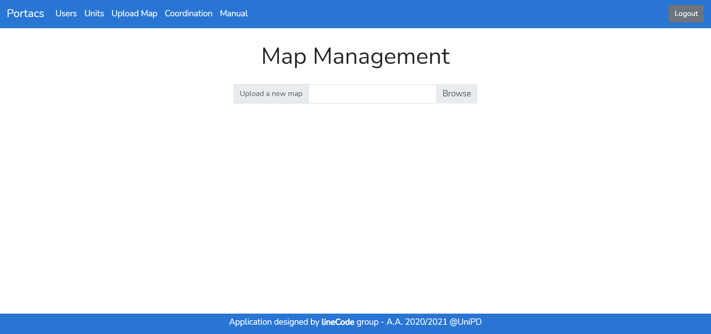

= PORTACS - Manuale Utente
gruppo lineCode <linecode.swe@gmail.com>
v0.1.0, 18-07-2021
:doctype: book
:title-logo-image: ../../commons/res/lclong.png
:toc:
:toclevels: 4
:sectnums:
:sectnumlevels: 4
:chapter-label:

.Dati sul documento
[cols=2]
|===
|Uso|Esterno

|Redattori
|Alessandro Dindinelli +
Lucia Fenu +
Valton Tahiraj
|Verificatori
|Giacomo Bulbarelli
|Responsabile
|Alessandro Chimetto
|Destinatari
|lineCode +
prof. Vardanega Tullio +
prof. Cardin Riccardo +
Sanmarco Informatica
|===
:counter: image-counter: 0
:toc:

<<<

:sectnums:
== Introduzione

=== Scopo del documento

Il documento vuole essere una guida per illustrare tutte le funzionalità del progetto PORTACS~G~.
In questo modo l'utente finale potrà effettuare un corretto uso del software~G~.

=== Scopo del prodotto

Il capitolato~G~ C5 ha come obbiettivo la realizzazione di un applicativo Real-Time~G~
in grado di guidare delle unità dotate di mobilità autonoma in ambienti specifici,
partendo dal presupposto che queste si muovano in ambienti in cui sono presenti altre unità (autonome o meno).

<<<

== Istruzioni per l'utilizzo

=== Schermata iniziale

==== Login

La schermata iniziale corrisponde alle pagine di Login,
in cui l'utente registrato dovrà inserire le credenziali corrette affinché l'accesso vada a buon fine.
In caso contrario verrà visualizzato un apposito messaggio di errore.

[#img-sunset]
.Login
image::img/login.png[id="Figure-{counter:image-number}"]

==== Mappa in sola lettura

In qualsiasi momento è disponibile la visualizzazione in sola lettura della mappa e delle unità in movimento,
anche per utente non registrati.
Tali utenti possono accedere alla mappa tramite l'apposito pulsante presente nella pagina di login.

La stessa visualizzazione è disponibile anche per gli utenti registrati
cliccando sulla scritta Portacs presente nella barra di navigazione di ogni pagina.

[#img-sunset]
.Bottone visualizzazione mappa da utente non registrato

[#img-sunset]
.Visualizzazione mappa in sola lettura
image::img/home_non_auth.png[id="Figure-{counter:image-number}"]

=== Guida Utente

Il presente manuale è reso disponibile online per tutti gli utenti autenticati,
tramite un apposito link nella rispettiva barra di navigazione.

=== Schermata coordinatore

Il coordinatore ha a disposizione una schermata completa che permette eseguire tutte le azioni previste,
senza bisogno di navigare altre pagine. In ogni momento vengono visualizzati:

* la mappa, aggiornata in tempo reale con la posizione delle unità attive, e degli ostacoli da esse rilevate;
* la tabella con l'elenco delle unità attive, con i rispettivi dettagli.

[#img-sunset]
.Schermata coordinatore
image::img/user_coordination.png[id="Figure-{counter:image-number}"]

==== Visualizzazione unità attive

La tabella contiene tutte le informazioni utili per ogni unità presente nel sistema:

* Name: il nome dell'unità visualizzabile all'interno della mappa;
* Base: la posizione della base per la specifica unità;
* Position: la posizione corrente dell'unità;
* Status: lo status corrente dell'unità tra i seguenti:
        - Going to: l'unità è in movimento verso il punto di interesse;
        - Stop: l'unità è ferma;
        - Base: l'unità è alla sua postazione di base;
        - Error: l'unità ha rilevato un errore;
* Speed: la velocità corrente dell'unità;
* Error: segnalazione errori.

Le unità possono essere selezionate tramite il bottone "@", che una volta cliccato
mostrerà la tabella per la gestione della specifica unità.

==== Gestione ordini e unità

[#img-sunset]
.Gestione ordini e unità
image::img/gestione_ordini.PNG[id="Figure-{counter:image-number}"]

Tramite la seguente tabella gestionale è possibile comandare l'unità selezionata.

Se l'unità si trova nella propria cella base, è possibile fornire o rimuovere ordini dalla coda
dell'unità. Un'ordine è rappresentato da un Point of Interest, e pertanto devono essere fornite delle
coordinate valide, altrimenti verrà visualizzato un apposito messaggio d'errore.

Le unità possono essere parzialmente guidate tramite i seguenti bottoni, che vengono attivati o disabilitati
in base allo stato corrente dell'unità stessa:

* Start: l'unità inizia o riprende il percorso;
* Go back: l'unità ritorna alla base;
* Stop: l'unità si ferma;
* Shutdown: l'unità si spegne.

=== Schermata admin

L'amministratore ha a disposizione la maggior quantità di pagine navigabili, in base alle azioni che deve svolgere.
É previsto che un amministratore possa anche compiere le azioni di un coordinatore.

* Portacs: si accede alla pagina di visualizzazione della mappa in sola lettura;
* Users: si accede alla pagina di gestione utenti;
* Units:si accede alla pagina di gestione unità;
* Map: si accede alla pagina di gestione mappa;
* Coordination: si accede alla pagina di gestione, usata dai Coordinatori;
* Manual: si accede al Manuale utente.

[#img-sunset]
.Menù amministratore
image::img/home_non_auth-vistaDaAdmin_menu.png[id="Figure-{counter:image-number}"]

==== Gestione utenti

[#img-sunset]
.Gestione utenti
image::img/admin_user.png[id="Figure-{counter:image-number}"]

Per la gestione degli utenti, è previsto che l'amministratore possa visualizzare tutti gli utenti registrati
al sistema tramite la tabella centrale. Da qui li può eliminare con l'apposito pulsante,
oppure tramite il form in alto andare a crearne di nuovi.

Le informazioni richieste per la creazione di un utente sono:

* Username;
* Password;
* Status utente:
        - Admin: l'utente creato avrà lo stato di amministratore;
        - User: l'utente creato avrà lo stato di coordinatore.

In caso di errori nell'input dei dati utente, verranno visualizzati degli appositi messaggi di errore.

==== Gestione unità

[#img-sunset]
.Gestione unità
image::img/admin_unit.png[id="Figure-{counter:image-number}"]

Per la gestione delle unità, l'amministratore può visualizzare tutte le unità registrate
nel sistema nella tabella centrale. Da qui le può eliminare con l'apposito pulsante,
oppure usare il form presente per inserire i dettagli della nuova unità che si vuole registrare.

Le informazioni richieste per la creazione di un'unità sono:

* ID: identificativo di fabbrica dell'unità;
* Name: nome dell'unità che verrà visualizzato nella mappa;
* Base:
- X: coordinata X della cella base nella mappa;
- Y: coordinata y della cella base nella mappa.

In caso di errori nell'input dei campi dati, verranno visualizzati degli appositi messaggi di errore.

==== Gestione Mappa

[#img-sunset]
.Gestione mappa

Per modificare lo stato della mappa, l'amministratore ha la possibilità di importare dei file
in formato .txt appositamente formattati.

Nel caso ci siano degli errori nel file di importazione, verranno visualizzati degli appositi messaggi di errore.