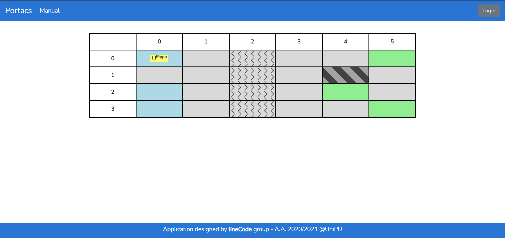
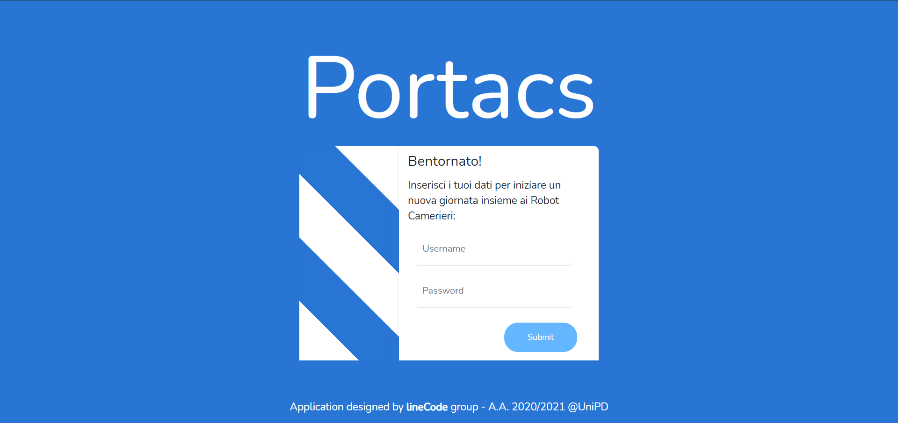
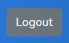
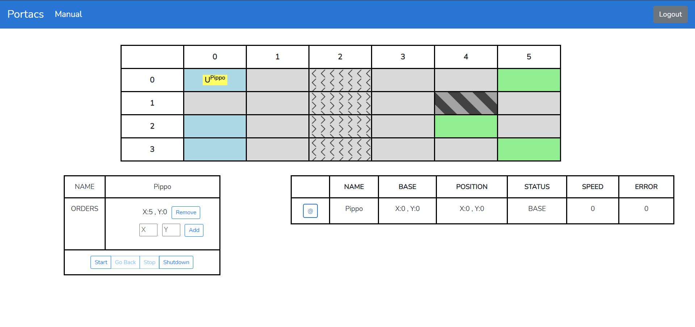
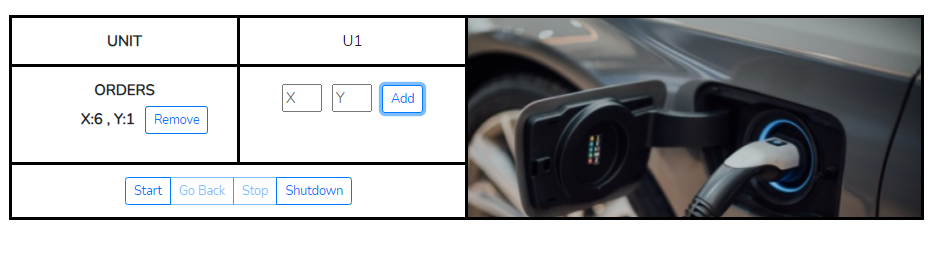
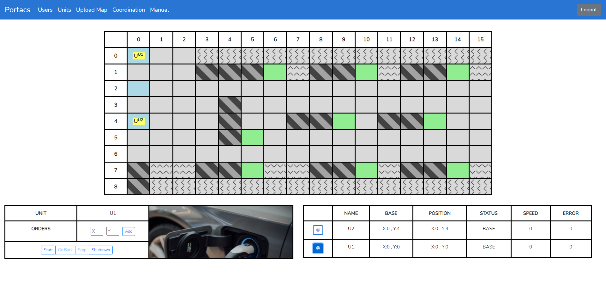
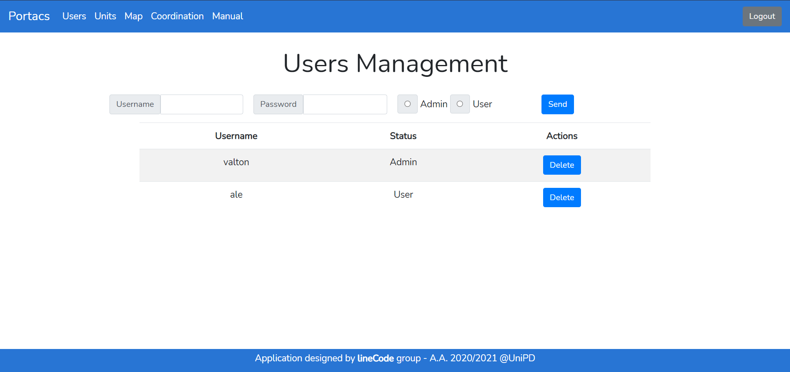
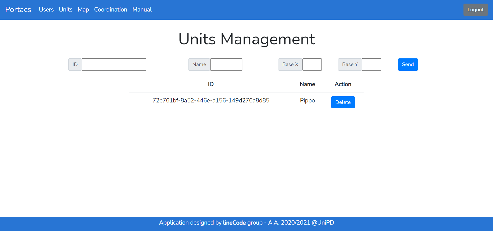

= Manuale utente
:sectnums:
:toc:

== Introduzione

=== Scopo del documento
Il documento vuole essere una guida per illustrare tutte le funzionalità del progetto PORTACS~G~. In questo modo l'utente finale potrà effettuare un corretto uso del software~G~.

=== Scopo del prodotto
Il capitolato~G~ C5 ha come obbiettivo la realizzazione di un applicativo Real-Time~G~ in grado di guidare delle unità dotate di mobilità autonoma in ambienti specifici, partendo dal presupposto che queste si muovano in ambienti in cui sono presenti altre unità (autonome o meno).

=== Glossario e documenti esterni
In supporto alla documentazione viene fornito un glossario per chiarire, con una definizione, eventuali termini specifici contenuti in questo documento.
Saranno adottati quindi questi due simboli a pedice:

* D: indica un documento specifico;
* G: indica un termine incluso nel Glossario v3.0.0.

== Requisiti minimi di sistema

=== Requisiti hardware
Non ci sono particolari requisiti hardware, nei dispositivi di test, anche non troppo recenti, non sono stati riscontrati problemi.

=== Requisiti software
Il software è stato testato in tutti e tre gli ambienti più utilizzati:

* Linux Ubuntu 19.10;
* macOS 14.1;
* Windows 10.21H1.

== Installazione

== Istruzioni per l'utilizzo

=== Schermata iniziale

La schermata iniziale, dedicata agli utenti non autenticati, permette la visualizzazione della
mappa in sola lettura. Questa, mostra le unità in attività all'interno del locale.

Da questa schermata è possibile:

* Autenticarsi tramite l'apposito bottone (in alto a destra) di Login;
* visualizzare il Manuale utente tramite il menù "Manual".

[#img-sunset]
.Schermata iniziale

==== Login
Inserendo Username e Password è possibile accedere al portale.
Non è possibile creare un nuovo utente da questa schermata.

Al primo accesso verranno inviate all'e-mail fornita, le credenziali per accedere correttamente come
amministratore.

[#img-sunset]
.Schermata Login

==== Logout

Effettuato correttamente l'accesso al portale, è possibile uscire da esso tramite il relativo bottone di
"Logout" (in alto a destra) del menù.

[#img-sunset]
.Bottone Logout

=== Schermata coordinatore

Il coordinatore può gestire le unità all'interno della mappa tramite le tabelle di gestione.

Anche da questa schermata è possibile visualizzare il Manuale utente, dal menù.

[#img-sunset]
.Schermata coordinatore

==== Visualizzazione unità attive

La tabella contiente tutte le informazioni utili per ogni unità presente nel sistema:

* Nome: il nome dell'unità visualizzabile all'interno della mappa;
* Base: la posizione della base per la specifica unità;
* Position: la posizione corrente dell'unità;
* Status: lo status corrente dell'unità;
* Speed: la velocità corrente dell'unità
* Error: segnalazione errori.

Le unità possono essere attivite e/o controllate tramite il botton "@" .
Una volta cliccato apparità la tabella per la gestione dell'unità selezionata.

[#img-sunset]
.Unità attive
image::../img/GestioneUnità.PNG[]

==== Gestione ordini e unità

Tramite la seguente tabella gestionale è possibile aggiungere dei Punti di interesse all' unità selazionata dalla precedente tabella e
visionarne i realtivi ordini nella colonna adiacente "Orders".

Dopo aver inserito le coordinate (x,y) nell'apposito form, premere il bottone "Add" per confermare il Punto
di interesse.

Le unità possono essere parzialmente guidate tramite i bottoni:

* Start: l'unità inizia o riprende il percorso;
* Go back: l'unità ritorna alla base,
* Stop: l'unità si ferma,
* Shutdown : l'unità si spegne.

[#img-sunset]
.Genstione ordini e unità

=== Schermata admin

L'amministratore, come il coordinatore, può gestire le unità all'interno della mappa (vedere paragrafo 4.2).

[#img-sunset]
.Schermata non not auth

==== Gestione utenti
L'inserimento di nuovi utenti è gestito dall'amministatore, tramite apposito form:

* Username: creazione di un username per l'utente;
* Password: creazione di una password per l'utente.
* Status utente:
        - Admin: l'utente creato avrà lo stato di amministratore,
        - User: l'utente creato avrà lo stato di coordinatore.

Completati i campi nel form, premere il bottone "Send" per confermare.
Il nuovo utente verrà visualizzato nell'ultima riga della tabella sottostante.

Premendo il bottone "Delete", l'utente viene eliminato dal sistema.

[#img-sunset]
.Gestione utenti

==== Gestione unità
L'inserimento di nuove unità è gestito dall'amministatore, tramite apposito form:

* ID: identificativo di fabbrica dell'unità;
* Name: nome dell'unità che verrà visualizzato durante la coordinazione.
* Base:
- X: coordinata X per il posizionamento in base dell'unità
- Y: coordinata y per il posizionamento in base dell'unità

Completati i campi nel form, premere il bottone "Send" per confermare.
La nuova verrà visualizzata nell'ultima riga della tabella sottostante.

Premendo il bottone "Delete", l'unità viene eliminata dal sistema.

[#img-sunset]
.Gestione unità

