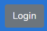

= Manuale utente
:counter: image-counter: 0
:toc:

<<<

:sectnums:
== Introduzione

=== Scopo del documento
Il documento vuole essere una guida per illustrare tutte le funzionalità del progetto PORTACS~G~. In questo modo l'utente finale potrà effettuare un corretto uso del software~G~.

=== Scopo del prodotto
Il capitolato~G~ C5 ha come obbiettivo la realizzazione di un applicativo Real-Time~G~ in grado di guidare delle unità dotate di mobilità autonoma in ambienti specifici, partendo dal presupposto che queste si muovano in ambienti in cui sono presenti altre unità (autonome o meno).

<<<

== Istruzioni per l'utilizzo

=== Schermata iniziale
==== Login

La schermata inizale corrisponde alla pagine di Login, in cui l'utente registrato dovrà inserire le credenziali corrette
affinchè l'accesso vada a buon fine.

[#img-sunset]
.Login
image::../img/login.png[id="Figure-{counter:image-number}"]

==== Utente non registrato
Tramite il bottone seguente, si passa alla visualizzazione della mappa in sola lettura, disponibile per gli utenti non registrati nel sistema.

[#img-sunset]
.Bottone visualizzaione mappa da utente non registrato
image::../img/login_bottone.png[align="center", id="Figure-{counter:image-number}"]

La visualizzazione della mappa da utente non registrato è la seguente:

[#img-sunset]
.Visulizzazione mappa da utente non registrato
image::../img/home_non_auth.png[id="Figure-{counter:image-number}"]

Dal bottone "Login", in alto a destra, si ritorna alla pagina di autenticazione.
[#img-sunset]
.Bottone Login

==== Logout

Effettuato correttamente l'accesso al portale, è possibile uscire da esso tramite il relativo bottone di
"Logout", in alto a destra, del menù.

[#img-sunset]
.Bottone Logout
image::../img/logout.PNG[align="center", id="Figure-{counter:image-number}"]

=== Schermata coordinatore

Il coordinatore può gestire le unità all'interno della mappa tramite le tabelle di gestione.
La mappa rileva la posizione corrente delle unità registrate all'interno del sistema.

[#img-sunset]
.Schermata coordinatore
image::../img/user_coordination.png[id="Figure-{counter:image-number}"]

Dal menù è possibile:

* Manuale: si accede al Manuale utente;
* Logout: permette di effettuare il logout.

[#img-sunset]
.Menù coordinatore

==== Visualizzazione unità attive

[#img-sunset]
.Unità registrate
image::../img/GestioneUnità.PNG[id="Figure-{counter:image-number}"]

La tabella contiente tutte le informazioni utili per ogni unità presente nel sistema:

* Name: il nome dell'unità visualizzabile all'interno della mappa;
* Base: la posizione della base per la specifica unità;
* Position: la posizione corrente dell'unità;
* Status: lo status corrente dell'unità tra i seguenti:
        - Going to: l'unità è in movimento verso il punto di interesse;
        - Stop: l'unità è ferma;
        - Base: l'unità è alla sua postazione di base;
        - Error: l'unità ha rilevato un errore.
* Speed: la velocità corrente dell'unità
* Error: segnalazione errori.

Le unità possono essere attivite e/o controllate tramite il botton "@" .
Una volta cliccato apparità la tabella per la gestione dell'unità selezionata.

==== Gestione ordini e unità

[#img-sunset]
.Genstione ordini e unità
image::../img/gestione_ordini.PNG[id="Figure-{counter:image-number}"]

Tramite la seguente tabella gestionale è possibile aggiungere dei Punti di interesse all' unità selazionata dalla precedente tabella e
visionarne i realtivi ordini nella colonna adiacente "Orders".

Dopo aver inserito le coordinate (x,y) nell'apposito form, premere il bottone "Add" per confermare il Punto
di interesse.

Le unità possono essere parzialmente guidate tramite i bottoni:

* Start: l'unità inizia o riprende il percorso;
* Go back: l'unità ritorna alla base,
* Stop: l'unità si ferma,
* Shutdown : l'unità si spegne.

=== Schermata admin

L'amministratore, come il coordinatore, può gestire le unità all'interno della mappa (vedere paragrafo 2.2).

[#img-sunset]
.Schermata amministratore
image::../img/admin_coordination.png[id="Figure-{counter:image-number}"]

Da menù:

* Portacs: si accede alla pagina di visualizzazione della mappa in sola lettura;
* Users: si accede alla pagina di gestione utenti;
* Units:si accede alla pagina di gestione unità;
* Map: si accede alla pagina di gestione mappa;
* Coordination: si accede alla pagina di gestione ordini ed unità;
* Manual: si accede al Manuale utente;
* Logout: permette di effettuare il logout.

[#img-sunset]
.Menù amministratore
image::../img/home_non_auth-vistaDaAdmin_menu.png[id="Figure-{counter:image-number}"]

==== Gestione utenti

[#img-sunset]
.Gestione utenti
image::../img/admin_user.png[id="Figure-{counter:image-number}"]

L'inserimento di nuovi utenti,accessibile tramite il pulsante "Users" situato nel menù in alto a sinistra,è gestito dall'amministatore, tramite apposito form:

* Username: creazione di un username per l'utente;
* Password: creazione di una password per l'utente.
* Status utente:
        - Admin: l'utente creato avrà lo stato di amministratore,
        - User: l'utente creato avrà lo stato di coordinatore.

Completati i campi nel form, premere il bottone "Send" per confermare.
Il nuovo utente verrà visualizzato nell'ultima riga della tabella sottostante.

Premendo il bottone "Delete", l'utente viene eliminato dal sistema.

==== Gestione unità

[#img-sunset]
.Gestione unità
image::../img/admin_unit.png[id="Figure-{counter:image-number}"]

L'inserimento di nuove unità,accessibile tramite il pulsante "Units" situato nel menù in alto a sinistra, è gestito dall'amministatore, tramite apposito form:

* ID: identificativo di fabbrica dell'unità;
* Name: nome dell'unità che verrà visualizzato durante la coordinazione.
* Base:
- X: coordinata X per il posizionamento in base dell'unità
- Y: coordinata y per il posizionamento in base dell'unità

Completati i campi nel form, premere il bottone "Send" per confermare.
La nuova verrà visualizzata nell'ultima riga della tabella sottostante.

Premendo il bottone "Delete", l'unità viene eliminata dal sistema.

==== Gestione Mappa

[#img-sunset]
.Gestione mappa
image::../img/admin_map.png[id="Figure-{counter:image-number}"]

L'importanzione della nuova mappa se avvenuta correttamente, permette di mmostrare una anteprima della
mappa che verrà utilizzata all'interno del sistema.

